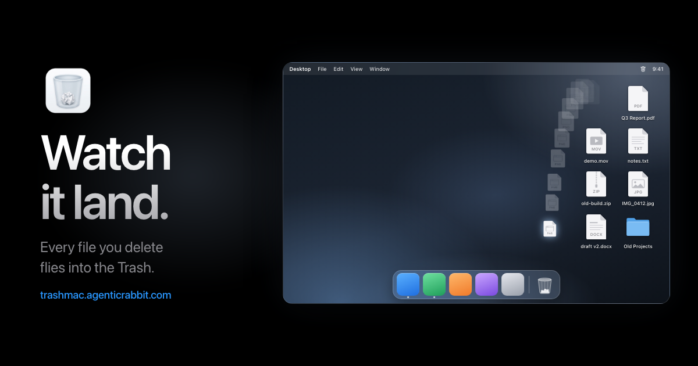

# TrashMac

A menu bar app that shows a file flying into the Dock's Trash every time you delete something.

**[Download TrashMac.dmg](https://github.com/MPL0Y/trashmac/releases/latest/download/TrashMac.dmg)** (macOS 13+), or install it with Homebrew:

    brew install --cask mpl0y/tap/trashmac

Or build it yourself:

    ./build.sh      # makes TrashMac.dmg

The download isn't notarized, so on first launch macOS blocks it: go to System Settings → Privacy & Security and click **Open Anyway**. A copy you build yourself opens without this step.

When the app first opens, give it Accessibility access (System Settings → Privacy & Security). It uses that to find exactly where the Trash icon is in the Dock, and plays a test flight as soon as you allow it. Check for Updates in the menu bar tells you when a new version is out.
